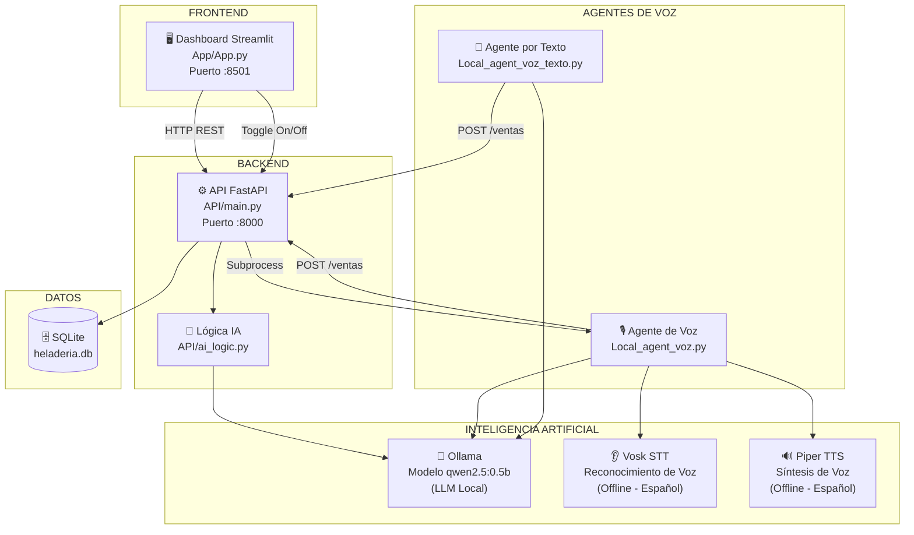
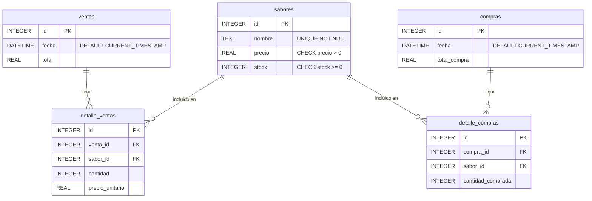
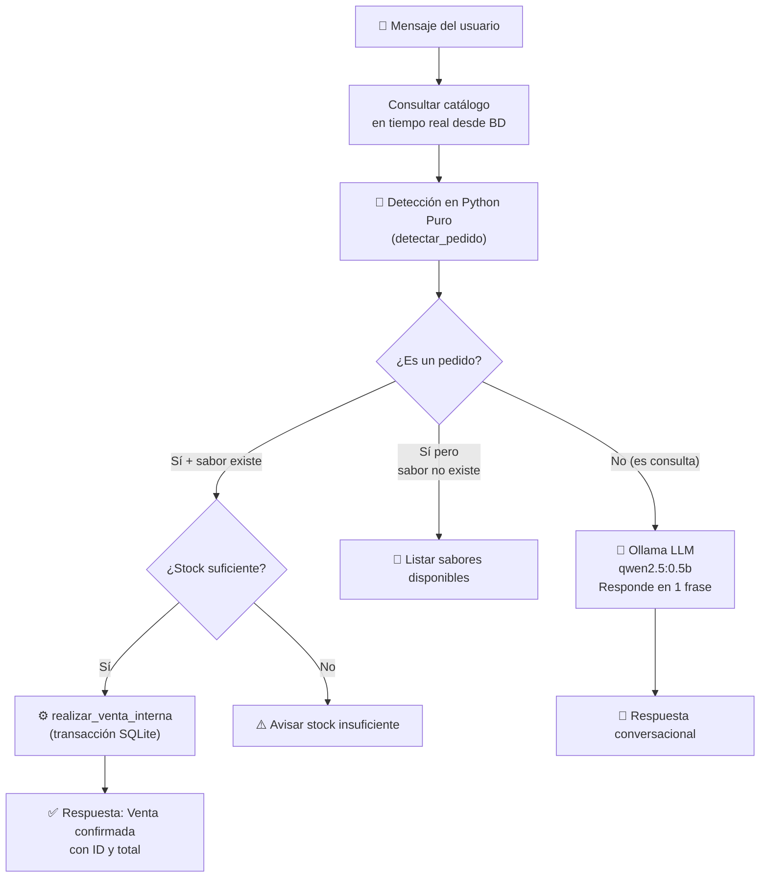
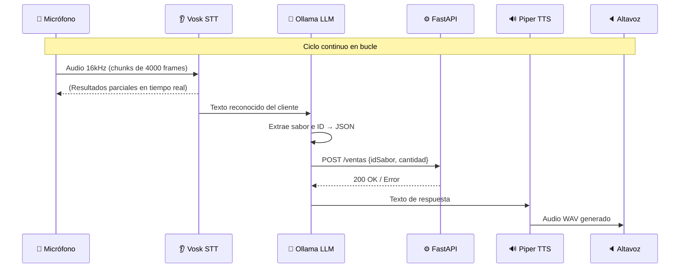

# 🍦 HeladerIA — Documentación Técnica del Proyecto

> Sistema inteligente de gestión para heladería con Inteligencia Artificial, asistente de voz offline y dashboard web profesional.

---

## 📋 Tabla de Contenidos

1. [Descripción General](#descripción-general)
2. [Arquitectura del Sistema](#arquitectura-del-sistema)
3. [Tecnologías Utilizadas](#tecnologías-utilizadas)
4. [Estructura del Proyecto](#estructura-del-proyecto)
5. [Base de Datos](#base-de-datos)
6. [API REST — Backend](#api-rest--backend)
7. [Dashboard Web — Frontend](#dashboard-web--frontend)
8. [Módulo de Inteligencia Artificial](#módulo-de-inteligencia-artificial)
9. [Agente de Voz Offline](#agente-de-voz-offline)
10. [Flujo de Trabajo Completo](#flujo-de-trabajo-completo)
11. [Despliegue con Docker](#despliegue-con-docker)
12. [Despliegue en Raspberry Pi](#despliegue-en-raspberry-pi)
13. [Modos de Operación](#modos-de-operación)

---

## Descripción General

**HeladerIA** es un sistema de gestión integral para una heladería, diseñado para automatizar y digitalizar las operaciones del negocio mediante tecnología moderna de Inteligencia Artificial. El proyecto integra un backend robusto, una interfaz gráfica de usuario interactiva y un asistente inteligente capaz de tomar pedidos, tanto por texto como por voz, de manera completamente offline.

### Características Principales

| Característica | Descripción |
|---|---|
| 🤖 **Asistente IA de Chat** | Chatbot inteligente que entiende lenguaje natural para tomar pedidos y resolver consultas |
| 🎙️ **Agente de Voz Offline** | Reconocimiento de voz en español sin depender de internet (Vosk + Piper) |
| 📦 **Gestión de Inventario** | CRUD completo de sabores: agregar, editar, eliminar, con control de stock automático |
| 💰 **Registro de Ventas** | Registro manual y automático (vía IA) con historial detallado |
| 🚚 **Gestión de Compras** | Control de abastecimiento con actualización automática del stock |
| 🐳 **Contenedorizado** | Despliegue completo con Docker Compose |
| 🍓 **Raspberry Pi Ready** | Script de despliegue automatizado para Raspberry Pi 4 (ARM64) |

---

## Arquitectura del Sistema

El sistema sigue una arquitectura de **microservicios desacoplados** donde cada componente se comunica a través de la API REST central.



### Comunicación entre Componentes

- **Frontend → API**: El dashboard Streamlit realiza llamadas HTTP REST a FastAPI para todas las operaciones (inventario, ventas, compras, IA).
- **API → Base de Datos**: FastAPI accede directamente a SQLite a través del módulo `DataBase/Conexion.py`.
- **API → Ollama**: Para consultas conversacionales, la API llama al modelo de lenguaje local vía la librería `ollama`.
- **Agente de Voz → API**: El agente de voz es un proceso independiente que, después de procesar el audio, envía los pedidos confirmados a la API mediante `POST /ventas`.
- **API → Agente de Voz**: La API puede iniciar y detener el proceso del agente de voz mediante `subprocess.Popen`.

---

## Tecnologías Utilizadas

### Backend & API

| Tecnología | Versión | Rol |
|---|---|---|
| **Python** | 3.11 | Lenguaje principal del proyecto |
| **FastAPI** | 0.135.1 | Framework web para la API REST de alto rendimiento |
| **Uvicorn** | 0.41.0 | Servidor ASGI para ejecutar FastAPI |
| **Pydantic** | 2.12.5 | Validación y serialización de datos (modelos de la API) |
| **SQLite** | (built-in) | Base de datos embebida, sin servidor adicional |
| **Starlette** | 0.52.1 | Framework base de FastAPI (middleware CORS) |

### Frontend & Dashboard

| Tecnología | Versión | Rol |
|---|---|---|
| **Streamlit** | 1.55.0 | Framework para crear el dashboard web interactivo con Python |
| **streamlit-option-menu** | latest | Menú de navegación lateral con iconos |
| **Requests** | 2.32.5 | Librería HTTP para que el frontend llame a la API |

### Inteligencia Artificial

| Tecnología | Versión | Rol |
|---|---|---|
| **Ollama** | 0.6.1 | Runtime para ejecutar modelos LLM localmente (sin internet) |
| **qwen2.5:0.5b** | — | Modelo de lenguaje ligero (500M params) para respuestas y extracción de datos |
| **Vosk** | 0.3.45 | Motor de reconocimiento de voz offline para español |
| **vosk-model-small-es-0.42** | — | Modelo de lenguaje acústico en español para Vosk |
| **Piper TTS** | 2023.11 | Sintetizador de voz de alta calidad (Text-to-Speech) offline |
| **voz_es.onnx** | — | Modelo de voz en español mexicano para Piper |
| **PyAudio** | 0.2.14 | Acceso al micrófono para captura de audio en tiempo real |

### DevOps & Despliegue

| Tecnología | Rol |
|---|---|
| **Docker** | Contenedorización de los servicios |
| **Docker Compose** | Orquestación de múltiples contenedores |
| **Bash Scripts** | Automatización del despliegue en Raspberry Pi |

---

## Estructura del Proyecto

```
Heladeria/
│
├── 📁 API/                          # Backend: API REST con FastAPI
│   ├── __init__.py
│   ├── main.py                      # Endpoints, lógica de negocio, rutas IA
│   └── ai_logic.py                  # Funciones auxiliares: TTS (hablar) y extracción IA
│
├── 📁 App/                          # Frontend: Dashboard Streamlit
│   ├── __init__.py
│   └── App.py                       # Interfaz completa: IA, Inventario, Ventas, Compras
│
├── 📁 DataBase/                     # Capa de datos
│   ├── __init__.py
│   ├── Conexion.py                  # Definición del esquema y ruta a la BD
│   └── heladeria.db                 # Archivo SQLite (base de datos real)
│
├── 📁 modelo_vosk/                  # Modelo de reconocimiento de voz (Vosk, español)
├── 📁 piper/                        # Binario del sintetizador de voz Piper
│
├── 🐍 Local_agent_voz.py            # Agente de voz completo (micrófono → IA → venta → audio)
├── 🐍 Local_agent_voz_texto.py      # Versión de prueba del agente (entrada por teclado)
│
├── 🐳 Dockerfile                    # Imagen Docker multi-arquitectura (x86 + ARM64)
├── 🐳 docker-compose.yml            # Orquestación: api + app + voz
├── 📜 deploy_raspberry.sh           # Script automatizado de despliegue en Raspberry Pi
├── 📜 setup_services.sh             # Script auxiliar de configuración de servicios
│
├── 🗄️ script.sql                    # Esquema SQL manual de referencia
├── 📋 requirements.txt              # Dependencias Python del proyecto
├── 📄 Readme.md                     # Instrucciones básicas
├── voz_es.onnx                      # Modelo de voz ONNX para Piper (español MX)
└── voz_es.onnx.json                 # Configuración del modelo de voz
```

---

## Base de Datos

El sistema usa **SQLite** como motor de base de datos. Es una base de datos embebida, lo que la hace perfecta para dispositivos como la Raspberry Pi (sin necesidad de instalar un servidor de base de datos). La base de datos se crea y se siembra automáticamente en el primer arranque del sistema.

### Esquema de Tablas



### Triggers Automáticos

La base de datos cuenta con dos **triggers** que automatizan el control del inventario:

| Trigger | Evento | Efecto |
|---|---|---|
| `actualizar_stock_venta` | `AFTER INSERT ON detalle_ventas` | **Descuenta** la cantidad vendida del stock del sabor |
| `actualizar_stock_compra` | `AFTER INSERT ON detalle_compras` | **Suma** la cantidad comprada al stock del sabor |

> [!IMPORTANT]
> Gracias a los triggers, el stock **nunca necesita actualizarse manualmente**. Al registrar una venta o compra, la base de datos se actualiza sola de forma atómica y consistente.

### Datos Semilla

Al inicializar la base de datos, se insertan 5 sabores de ejemplo:

| ID | Nombre | Precio | Stock inicial |
|---|---|---|---|
| 1 | Vainilla | $3,500 | 50 |
| 2 | Chocolate | $4,000 | 40 |
| 3 | Fresa | $3,500 | 35 |
| 4 | Mango | $4,500 | 30 |
| 5 | Cookies and Cream | $5,000 | 25 |

---

## API REST — Backend

El backend está construido con **FastAPI** y expone una API REST que centraliza toda la lógica de negocio. Se ejecuta con Uvicorn en el puerto **8000**.

### Endpoints Disponibles

#### 🏥 Sistema

| Método | Ruta | Descripción |
|---|---|---|
| `GET` | `/health` | Verifica que la API está activa. Retorna `{"status": "online"}` |

#### 📦 Inventario (`/inventario`)

| Método | Ruta | Descripción | Body |
|---|---|---|---|
| `GET` | `/inventario` | Retorna la lista completa de sabores con precio y stock | — |
| `POST` | `/inventario` | Agrega un nuevo sabor | `{nombre, precio, stock}` |
| `PUT` | `/inventario` | Actualiza un sabor existente | `{id, nombre, precio, stock}` |
| `DELETE` | `/inventario/{sabor_id}` | Elimina un sabor (solo si no tiene ventas) | — |

> [!WARNING]
> No se puede eliminar un sabor que tenga ventas asociadas. La API retorna HTTP 400 si se intenta.

#### 💰 Ventas (`/ventas`)

| Método | Ruta | Descripción | Body |
|---|---|---|---|
| `POST` | `/ventas` | Registra una nueva venta con uno o más ítems | `{items: [{idSabor, cantidad}]}` |
| `GET` | `/ventas` | Retorna el historial de ventas con sus detalles | — |

La lógica interna de venta (`realizar_venta_interna`) usa **transacciones SQLite** para garantizar que, si falla un ítem, toda la venta se revierte (rollback).

#### 🚚 Compras (`/compras`)

| Método | Ruta | Descripción | Body |
|---|---|---|---|
| `POST` | `/compras` | Registra una entrada de mercancía | `{items: [{sabor_id, cantidad_comprada}], total_compra}` |

#### 🤖 Inteligencia Artificial (`/ai`)

| Método | Ruta | Descripción | Body |
|---|---|---|---|
| `POST` | `/ai/chat` | Procesa un mensaje de texto y retorna respuesta del asistente | `{message: string}` |
| `GET` | `/ai/status` | Consulta si el agente de voz está activo | — |
| `POST` | `/ai/voice/toggle` | Enciende o apaga el agente de voz | `{active: boolean}` |

### Modelos de Datos (Pydantic)

```python
# Modelo de un sabor existente (para actualizar)
class Sabor(BaseModel):
    id: int
    nombre: str
    precio: float
    stock: int

# Modelo para crear un nuevo sabor
class NuevoSabor(BaseModel):
    nombre: str
    precio: float
    stock: int

# Ítem de una venta
class VentaItem(BaseModel):
    idSabor: int
    cantidad: int

# Venta completa (lista de ítems)
class Venta(BaseModel):
    items: List[VentaItem]

# Ítem de una compra
class ItemCompra(BaseModel):
    sabor_id: int
    cantidad_comprada: int

# Compra completa
class Compra(BaseModel):
    items: List[ItemCompra]
    total_compra: float

# Mensaje para el chat de IA
class AIChatRequest(BaseModel):
    message: str
```

---

## Dashboard Web — Frontend

El frontend es una aplicación web interactiva construida con **Streamlit** que se ejecuta en el puerto **8501**. Se comunica con la API REST mediante la librería `requests`.

### Páginas / Secciones

#### 🤖 Panel IA (Página Principal)

- Interfaz de **chat** con el asistente inteligente de la heladería.
- El usuario puede preguntar por el menú, disponibilidad de sabores, precios o realizar pedidos en lenguaje natural.
- El historial de la conversación se mantiene en `st.session_state` durante la sesión.

**Ejemplo de interacción:**
```
👤 Usuario: "¿Qué sabores tienen disponibles?"
🤖 HeladerIA: "Tenemos Vainilla ($3,500), Chocolate ($4,000), Fresa ($3,500)..."

👤 Usuario: "Quiero 2 de chocolate"
🤖 HeladerIA: "✅ ¡Pedido registrado! 2x Chocolate | Total: $8,000 · Venta #12"
```

#### 📦 Inventario

- Visualización de todos los sabores en **tarjetas estilo card** con hover animado.
- **Agregar** nuevos sabores mediante formulario expandible.
- **Editar** sabor directamente desde la tarjeta (formulario inline).
- **Eliminar** sabor con protección de integridad referencial.

#### 💰 Ventas

Dividida en dos pestañas:
- **🛒 Nueva Venta**: Tabla interactiva con todos los sabores. El operador ingresa las cantidades y el total se calcula en tiempo real. Al confirmar, se muestra animación de globos (`st.balloons()`).
- **📜 Historial**: Lista expandible de todas las ventas con fecha, total y detalles de ítems.

#### 🚚 Compras

Dividida en dos pestañas:
- **➕ Registrar Compra**: Tabla para ingresar cantidades a reabastecer por sabor.
- **📋 Historial**: Historial de todas las compras de mercancía.

### Diseño y Estilos (CSS)

El dashboard aplica un CSS personalizado con:
- **Fuente**: Google Fonts — `Outfit` (pesos 300, 400, 600, 700).
- **Sidebar**: Gradiente rosa intenso (`#e91e8c → #c2185b`) con texto blanco.
- **Tarjetas de sabores**: Fondo blanco, bordes redondeados (`20px`), sombras suaves y efecto hover con elevación.
- **Chat**: Burbujas de mensajes con fondo blanco y bordes sutiles.
- **Paleta de colores principal**: Rosa heladería (`#e91e8c`), verde para precios (`#2e7d32`), azul para inversiones (`#1565c0`).

#### Control del Agente de Voz (Sidebar)

En la barra lateral hay un **toggle** (interruptor) para encender o apagar el agente de voz en tiempo real. Al activarlo, el frontend llama a `POST /ai/voice/toggle` y la API lanza el proceso en segundo plano.

---

## Módulo de Inteligencia Artificial

El módulo de IA (`API/main.py` + `API/ai_logic.py`) implementa una arquitectura híbrida de **detección en Python puro + LLM de respaldo**.

### Estrategia de Procesamiento de Mensajes



### Detección de Pedidos en Python Puro (`detectar_pedido`)

Esta función evita depender del LLM para la lógica crítica de negocio, garantizando fiabilidad:

1. **Detección de preguntas**: Busca palabras como `"qué"`, `"precio"`, `"cuánto"`, `"hay"`, `"disponible"`. Si encuentra y no hay intención de compra, lo clasifica como consulta.

2. **Detección de intención de compra**: Busca palabras clave como `"quiero"`, `"dame"`, `"quisiera"`, `"pido"`, `"tráeme"`, `"véndeme"`.

3. **Detección de cantidad**: Primero busca dígitos (`\b\d+\b`), luego palabras numéricas como `"un"`, `"dos"`, `"tres"`, etc. (soporta hasta 100).

4. **Matching de sabor**: Usa expresiones regulares con `re.escape` para encontrar el sabor que mejor coincide con el texto del usuario, evitando falsos positivos.

### Función `hablar` (TTS)

Convierte texto en audio usando **Piper** y lo reproduce con `aplay`:

```python
def hablar(texto):
    clean_text = texto.replace('"', '').replace('#', '')
    cmd = f'echo "{clean_text}" | ./piper/piper --model voz_es.onnx --output_file salida.wav'
    subprocess.run(cmd, shell=True, check=True)
    subprocess.run("aplay -q salida.wav", shell=True)
```

### Función `extraer_datos_pedido` (LLM con formato JSON)

Usa Ollama con el flag `format="json"` para extraer de forma estructurada el ID del sabor y la cantidad de un texto libre:

```python
# Ejemplo de respuesta del LLM:
# Input: "quisiera tres helados de mango"
# Output: {"idSabor": 4, "cantidad": 3}
```

---

## Agente de Voz Offline

El agente de voz (`Local_agent_voz.py`) es un programa independiente que implementa un ciclo completo de interacción por voz, **100% offline**, sin necesitar internet.

### Pipeline de Procesamiento de Voz



### Componentes del Agente de Voz

#### 1. `escuchar_cliente()` — Captura de Audio

- Usa **PyAudio** para acceder al micrófono del sistema.
- Captura audio en formato PCM 16-bit mono a **16.000 Hz** (requerido por Vosk).
- Procesa en chunks de 4.000 frames para baja latencia.
- Muestra resultados parciales en tiempo real (`PartialResult`) mientras el usuario habla.
- Detiene la escucha cuando Vosk entrega un resultado final (`AcceptWaveform → True`).

#### 2. `decodificar_y_vender()` — Procesamiento IA

- Envía el texto reconocido a **Ollama** con un prompt de sistema que incluye el catálogo actual.
- Fuerza al modelo a responder en formato JSON estricto: `{"idSabor": X, "cantidad": Y}`.
- Valida el JSON obtenido y llama a `POST /ventas` de la API.
- Maneja errores: sabor no encontrado, stock insuficiente, errores de conexión.

#### 3. `hablar()` — Síntesis de Voz

- Pasa el texto de respuesta al binario de **Piper** via `subprocess`.
- Genera un archivo `salida.wav`.
- Reproduce el audio con `aplay` (herramienta ALSA de Linux).

### Bucle Principal del Agente

```python
def iniciar_agente():
    # 1. Conecta con la API y carga el catálogo
    # 2. Saluda al cliente con voz
    while True:
        # 3. Refresca el catálogo (por si cambiaron los sabores)
        usuario_input = escuchar_cliente()        # Escucha
        if "salir" in usuario_input: break        # Condición de salida
        respuesta = decodificar_y_vender(input)  # Procesa
        hablar(respuesta)                          # Responde
```

### Agente por Texto (`Local_agent_voz_texto.py`)

Versión de depuración del agente de voz que reemplaza el micrófono con entrada por teclado (`input()`). Útil para probar el pipeline de IA y la integración con la API sin necesitar hardware de audio.

---

## Flujo de Trabajo Completo

### Escenario 1: Venta Manual desde el Dashboard

```
1. Operador abre el Dashboard (http://localhost:8501)
2. Navega a "Ventas" en el menú lateral
3. En la pestaña "Nueva Venta", selecciona cantidad de cada sabor
4. El total se calcula automáticamente en tiempo real
5. Presiona "Finalizar Venta"
6. El frontend llama a POST /ventas con los ítems seleccionados
7. FastAPI ejecuta realizar_venta_interna() en una transacción:
   a. Verifica stock disponible para cada ítem
   b. Inserta registro en tabla 'ventas'
   c. Inserta ítems en 'detalle_ventas'
   d. El trigger SQLite descuenta el stock automáticamente
8. La API retorna venta_id y total
9. El dashboard muestra animación de globos + mensaje de éxito
```

### Escenario 2: Pedido por Chat de IA

```
1. Cliente/Operador escribe en el chat del "Panel IA"
   Ejemplo: "quiero 3 de fresa"
2. El frontend envía POST /ai/chat {"message": "quiero 3 de fresa"}
3. La API consulta el catálogo desde la BD
4. detectar_pedido() identifica:
   - Intención de compra: "quiero" ✓
   - Sabor: "Fresa" (ID 3) ✓
   - Cantidad: 3 ✓
5. Se llama realizar_venta_interna() (misma lógica que venta manual)
6. La API retorna la respuesta formateada:
   "✅ ¡Pedido registrado! 3x Fresa | Total: $10,500 · Venta #15"
7. El chat muestra la respuesta al usuario
```

### Escenario 3: Pedido por Voz (Agente Offline)

```
1. El operador activa el toggle "Activar Micro" en el sidebar
2. El frontend llama a POST /ai/voice/toggle {"active": true}
3. La API lanza Local_agent_voz.py como subproceso
4. El agente saluda al cliente por el altavoz: "Hola, bienvenido..."
5. El agente escucha el micrófono con Vosk
6. El cliente habla: "dame dos de chocolate"
7. Vosk transcribe: "dame dos de chocolate"
8. Ollama extrae: {"idSabor": 2, "cantidad": 2}
9. El agente llama a POST /ventas en la API
10. La API registra la venta y descuenta el stock
11. Piper sintetiza: "¡Excelente elección! Pedido procesado."
12. El altavoz reproduce la respuesta
13. El ciclo vuelve a escuchar (paso 5)
```

### Escenario 4: Reabastecimiento de Inventario

```
1. Operador navega a "Compras" → "Registrar Compra"
2. Ingresa la cantidad a comprar por cada sabor
3. El sistema calcula la inversión total
4. Presiona "Registrar Entrada"
5. El frontend llama a POST /compras
6. La API registra la compra y sus detalles
7. El trigger SQLite suma las cantidades al stock de cada sabor
8. El inventario queda actualizado instantáneamente
```

---

## Despliegue con Docker

El sistema está completamente contenedorizado con **tres servicios** orquestados por Docker Compose.

### Servicios

```yaml
# Servicio 1: API FastAPI
api:
  puerto: 8000
  comando: uvicorn API.main:app --host 0.0.0.0 --port 8000
  volumen: ./DataBase  # BD persistente entre reinicios

# Servicio 2: Dashboard Streamlit
app:
  puerto: 8501
  comando: streamlit run App/App.py
  depende_de: api
  variable: API_URL=http://api:8000  # Nombre de servicio Docker

# Servicio 3: Agente de Voz
voz:
  comando: python Local_agent_voz.py
  depende_de: api
  dispositivos: /dev/snd  # Acceso al audio del host
  red: host              # Usa la red del host para audio
```

> [!NOTE]
> El servicio de voz usa `network_mode: host` en lugar de la red bridge de Docker para poder acceder correctamente al servidor de audio PulseAudio de la Raspberry Pi.

### Comandos de Uso

```bash
# Construir y levantar todos los servicios
docker-compose up --build -d

# Ver logs de todos los servicios
docker-compose logs -f

# Ver logs solo del agente de voz
docker-compose logs -f voz

# Detener todos los servicios
docker-compose down

# Reiniciar un servicio específico
docker-compose restart api
```

### Dockerfile (Multi-arquitectura)

La imagen base es `python:3.11-slim` compatible con `x86_64` y `ARM64` (Raspberry Pi). Instala las dependencias del sistema necesarias para el audio:

- `portaudio19-dev` — Soporte de PyAudio
- `python3-pyaudio` — Bindings de audio
- `alsa-utils` — Herramientas de audio ALSA (`aplay`)
- `libasound2-dev` — Cabeceras de desarrollo ALSA

Los modelos pesados (Vosk, Piper, voz ONNX) se **montan como volúmenes** para no inflar la imagen Docker.

---

## Despliegue en Raspberry Pi

El script `deploy_raspberry.sh` automatiza el despliegue completo en una Raspberry Pi 4 ejecutando un único comando.

### Pasos Automatizados

| Paso | Descripción |
|---|---|
| **[1/6]** | Instala dependencias del sistema (`portaudio`, `alsa-utils`, `wget`, `curl`) |
| **[2/6]** | Verifica e instala **Docker** (usando el script oficial de Docker) |
| **[3/6]** | Instala **Ollama** en el host (no en Docker) y descarga el modelo `llama3.2` |
| **[4/6]** | Descarga el modelo **Vosk** en español (`vosk-model-small-es-0.42`) |
| **[5/6]** | Descarga el binario de **Piper** para ARM64 y el modelo de voz español mexicano |
| **[6/6]** | Construye y levanta los contenedores Docker con `docker-compose up -d` |

### Ejecución

```bash
# En la Raspberry Pi, desde el directorio del proyecto:
bash deploy_raspberry.sh
```

Al finalizar, el script muestra las URLs de acceso:

```
✅ DESPLIEGUE COMPLETADO
   Dashboard: http://192.168.1.X:8501
   API:        http://192.168.1.X:8000
   La IA de Voz está escuchando en el contenedor 'heladeria-voz'
```

---

## Modos de Operación

### Modo Desarrollo (Local)

```bash
# Terminal 1: Levantar la API
uvicorn API.main:app --reload

# Terminal 2: Levantar el Dashboard
streamlit run App/App.py

# Terminal 3 (opcional): Agente por teclado para pruebas
python Local_agent_voz_texto.py
```

### Modo Producción (Docker)

```bash
docker-compose up -d
```

### Acceso a la Documentación Interactiva de la API

FastAPI genera automáticamente documentación Swagger UI:
- **Swagger**: `http://localhost:8000/docs`
- **ReDoc**: `http://localhost:8000/redoc`

---

## Resumen de Variables de Entorno

| Variable | Valor por defecto | Descripción |
|---|---|---|
| `API_URL` | `http://localhost:8000` | URL de la API FastAPI (usada por frontend y agentes) |
| `OLLAMA_MODEL` | `qwen2.5:0.5b` | Modelo LLM a usar con Ollama |
| `PULSE_RUNTIME_PATH` | `/run/user/1000/pulse` | Ruta del socket de PulseAudio (para Docker en Raspberry Pi) |

---

*Documentación generada el 1 de junio de 2026 · Proyecto HeladerIA*
